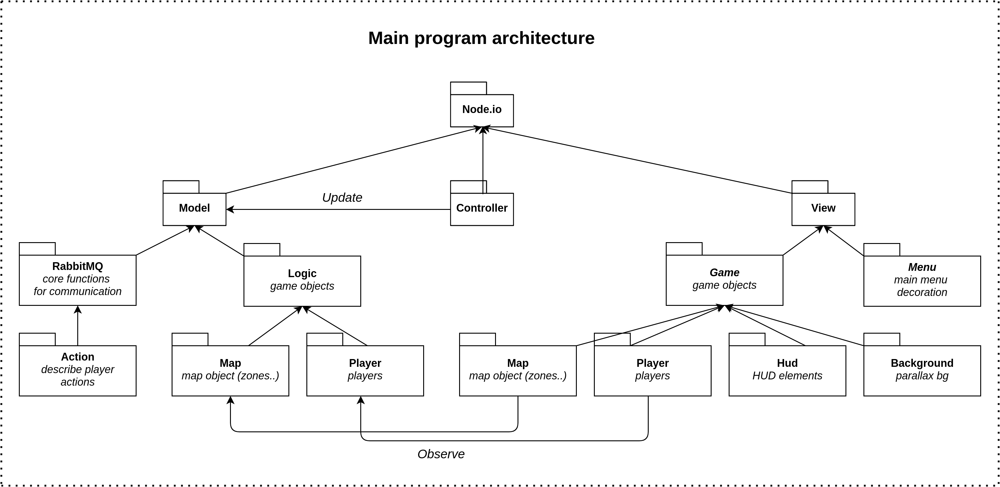

	 
	 
	
	<h1>Node.io</h1>
	

	<b>A cross platform multiplayer game for android, iOS, web and desktop, using RabbitMQ for communications.</b>
	

	 

    
	 
	 

## Demonstration

	
	 

## Description

Control your player and catch others to gain more zones. But watch out: players will try to catch
you too. Survive and catch them to be the one with the biggest number of zones!

## Implementation

Our game is implemented using the **Model View Controller** pattern. To achieve this, we use the 
**Observer** pattern proposed by Java.

* **The Model:**

    * The map is represented by `Zones`. Each `Zone` is represented by `Cells`. Players can move
      from one cell to another at a time.
    * When connecting, the player appears with an associated `Zone`. Each player is identified with
      a unique _ID_ which is the name of her/his communication _queue_ (given by the _RabbitMQ 
      server_).
    * All the things that the player can do is represented with a dedicated `Action`.
    * When a player wants to do something, she/he sends an `Action` to a special player; the _host_. 
      The _host_ validates it (checks if it is possible) before sending it to all the players. 
    * The _host_ if the first player to connect. She/he initiates the game. When she/he disconnects,
      we use an election algorithm that choose a random player among the connected ones, to give 
      this role to another player.
    
* **The View:**
    
    * There is a _view_ associated to each one of the _model classes_. They are `Observer` of them. 
    * A special _view_ is dedicated to the background.
    * And all the remaining _views_ are used to depict the _HUD_, and _GUI_. 
    * Also, the access to the model is synchronized between the rendering and updating threads using 
      a _lock_.

* **The Controller:**

    * Only one _class_ that handles the inputs of the player and updates the _model_ accordingly.
    
Here is the architecture of the game: 
    

	
	 

## RabbitMQ

As said before, we use **RabbitMQ** to handle communications between players.

* The _host_ uses a dedicated _queue_ to receive `Actions` from users.
* The _players_ are all connected to a _fan-out exchange_ using a queue. The _host_ publish the
  validated `Actions` in this _exchange_ so that every player receives and plays them.

Here is the complete architecture:

	
	 

## Theoretical Limits

Most of the limits of our game are related to the _host_. Here are the most important:

* _Host_ is the bottleneck of our game. If processing (_computation capacity_) or sending (_network
  speed_) an `Action` takes too much time for her/him, the game will be slowed down for every player. 
 
* In the same way, if too much players are connected and are playing at moment, the _host_ will 
  need more _computation speed_ to keep the game smooth. 
  
* The game is not fair, the _host_ is advantaged: when sending an `Action` every player should wait 
  for _host_ validation to update their model (_i.e. to receive back an `Action` from the host_),
  while the _host_ sees her/his model updated directly during the validation process. Thus there is
  no delay for the _host_.
  To avoid this we could update the model of the _host_ by also sending validation messages to 
  her/him like every other player. But during this time lapse, _host_ could validate actions from
  other player with a non-updated model. This could lead to collisions. To avoid this we could add
  a **Lamport timestamp** system, and enqueue the `Actions` received too early on the _host_ side.
  However this approach would imply a lot of modifications and efforts to make it work, this is why
  we chose to make the _host_ unfair.
  
## Instruction

To run and test `Node.io`, you can either:

* Load the project using `Android Studio` (or `Intellij`), `Gradle` tasks should load automatically.

* Launch gradle tasks using _CLI_ (not detailed). 

* Download the app on the `PlayStore` [here](https://play.google.com/store/apps/details?id=eagea.nodeio).

* Execute directly the app using the `.jar` file in the `Node.io/desktop/build/libs/` folder, for
  the desktop version.

## Attributions

* Background made by **[Enjl](https://enjl.itch.io/)**.

* Tiles made by **[Ajay Karat | Devil's Work.shop](https://www.devilswork.shop/)**.

* Character made by **[Gamekrazzy](https://gamekrazzy.itch.io/)**.

* Bush made by **[Dreammix](https://dreammix.itch.io/)**.

* Footstep sound made by **[GleenM](https://freesound.org/people/GlennM)**.

* Speak sound made by **[Juaner_](https://freesound.org/people/Juaner_/)**.

* Music _"Blob Monsters on the Loose"_ and _"Analog Nostalgia"_ made by **[Eric Matyas](https://soundimage.org/)**.
